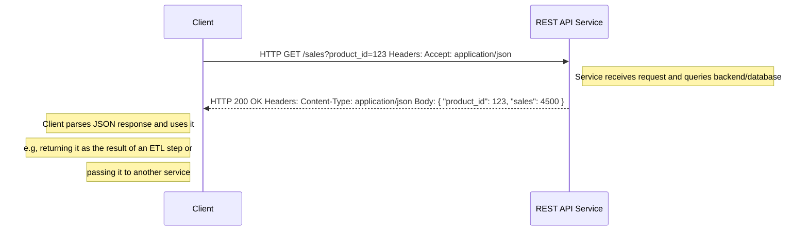

# Python Fundamentals for Calling Web Services Workshop

# 🐍 Python + REST API Workshop

This workshop is aimed at providing a sufficient understanding of python to make a request to a service running somewhere on the internet - a web service.

The internet is glued together by such requests - you can be booking a hotel on your mobile phone using the booking.com app, which will be making requests to their service at each point in the booking process. Or, you might be simply searching for something using Google in your browser on your laptop. Expecially relevant at the moment is leveraging the power of AI. All LLMs are exposed as web services - HTTP requests containing data in a request and response.

The example we will be using in todays workshop is based on a simple shop service. This is to allow us to focus on the "nuts and bolts" of how to make such requests seperately from any AI concerns. Future sessions will then build on this foundation to show how we can leverage AI services, such as accessing LLMs, in python.

Why Python?

The reason we’re using Python is the same reason the world’s biggest AI APIs support it first — simple, readable, and it just works effortlessly with the underlying protocols and technologies such as JSON, to make requests and process reponses.

Python is a great language for building everything from small one-off scripts to massively distributed systems (and everything in-between). It has a huge ecosystem of battle-tested libraries. It has natural support for different programming styles - procedural, OO and functional - and it can be as type-safe as your project needs require using tools like Mypy, Pylink, Black etc.

These things make it perfect for calling Web APIs - libraries like **requests** make it super simple to form a requests and process results.

## 1. Client–Server Interaction

### 1.1 Sequence Diagram


## 1.2. HTTP Request

```http
GET /sales?product_id=123 HTTP/1.1
Host: api.example.com
Accept: application/json
```

## 1.3 HTTP Response

```http
HTTP/1.1 200 OK
Content-Type: application/json

{ "product_id": 123, "sales": 4500 }
```

# 2. Python Workshop Steps
## 2.1 xxx

```python
from urllib import request, parse
import json

url = "https://api.example.com/sales?" + parse.urlencode({"product_id": 123})
with request.urlopen(url, timeout=10) as resp:
    data = json.loads(resp.read().decode("utf-8"))

print("Sales:", data["sales"])
```


