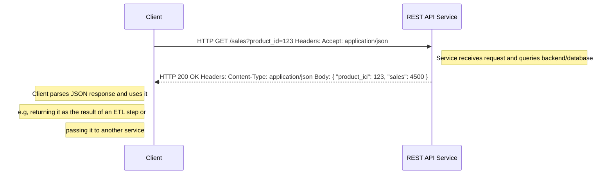

# 🐍  Core Python for Web Service Interaction Workshop

This section describes the workshop goals and a quick overview of some essential technical terms and concepts.

### Workshop Goals

This workshop is designed with two main goals in mind:

1. **Understanding Python for Web Requests:** You will learn the essential Python skills needed to interact with web services—making HTTP requests, handling responses, and working with data formats like JSON. By the end, you’ll be able to connect to APIs and process their results using Python.

2. **Getting Comfortable with VS Code:** Along the way, you’ll gain hands-on experience with Visual Studio Code (VS Code), one of the most popular and powerful integrated development environments. You’ll learn how to set up your workspace, run Python code, and use key features that boost productivity.

By combining these two objectives, you’ll be well-equipped to build Python applications that communicate with web services, all within a modern development environment.

### What is HTTP?

HTTP (Hypertext Transfer Protocol) is the foundational protocol used by web browsers and APIs to send and receive data over the internet.

Much of the internet's communication is built on HTTP requests. For example, when you book a hotel using the booking.com app on your phone, each step in the process sends requests to their backend services. Similarly, searching for something on Google in your browser triggers a series of web requests behind the scenes. 

### In Context with Artificial Intelligence

How does this workshop relate to AI?

As you'd expect, large language models (LLMs) are accessed via web services that expose an HTTP API - you send your prompt or data in an HTTP request and receive a response for further processing.

In this workshop, we'll use a simple shop service to focus our attention on the core mechanics of making web requests in Python, without the added complexity of AI.

In future sessions, we'll build on this foundation to show how you can connect to AI services, such as LLMs, using Python.

### Why Python?

Python is the language of choice for this workshop—and for many of the world’s leading AI and web services—because it’s simple, readable, and works seamlessly with modern protocols like HTTP and data formats like JSON. This makes it easy to send requests and handle responses when working with web APIs.

Beyond its clarity and ease of use, Python is incredibly versatile. Whether you’re writing a quick script or building a large-scale distributed system, Python’s extensive ecosystem of libraries has you covered. It supports multiple programming styles—procedural, object-oriented, and functional—and can be as type-safe as you need, thanks to tools like Ruff, Mypy, and Black.

In short, Python’s combination of simplicity, power, and flexibility makes it the perfect fit for calling web APIs and building modern applications.

These things make it perfect for calling Web APIs - libraries like **requests** make it super simple to form a requests and process results.

### JSON and pydantic

JSON is the standard format for exchanging data in web APIs. In Python, the Pydantic library makes it easy to define data models with clear, type-checked fields. By combining Pydantic with JSON, you can write business logic using strongly typed Python classes and seamlessly convert them to and from JSON when sending or receiving HTTP requests. This approach ensures your data is both structured and easy to work with throughout your application.

## 1. Client–Service Interaction

### 1.1 Sequence Diagram
The diagram below breaks-down a web request into the HTTP request and response parts.

In a minute, we will see how this maps onto our python workshop client implementation by writing some python to generate and send a request and process the response from the service.




### 1.2. HTTP Requests

An HTTP request is a message a client sends to a server over the HTTP protocol to ask for something or to change something. It has three main parts:

Request line — method + path + protocol version
e.g. GET /users/42?fields=name HTTP/1.1

Headers — metadata (auth, content type, caching, etc.)
e.g. Authorization: Bearer <token>, Accept: application/json

Body (optional) — data you send (JSON, form, file, etc.)
used with POST, PUT, PATCH, sometimes DELETE.

The server replies with an HTTP response: status line (e.g. 200 OK), headers, and an optional body.

In this example, we are "getting" the sales data for a specific product.

```http
GET /sales?product_id=123 HTTP/1.1
Host: api.example.com
Accept: application/json
```

The API exposed by our shop service can be seen here: http://127.0.0.1:8000/docs

# 2. Python Workshop Steps

We are going to implement two functions that use web requests to perform the following tasks:

1. **Add a product to the shop**
2. **Retrieves annual sales data and displays it as a graph**

Both steps require that we make changes to the __shop_api.py__ module, which encapsulates the HTTP API.

## 2.1 Start the Shop Service

Our workshop client will be making requests to a fake shop services that exposes an HTTP API we will be using.

Start the shop service using the __Shop Service__ run configuration in VS Code.

The service publishes its HTTP API here:- http://127.0.0.1:8000/docs

Open this page.

## 2.1 Task 1 - Implement Add Product API Function

Run the Workshop client using the __Workshop client__ run configuration in VS Code. This is our business logic and it calls functions in the __shop_api.py__ module to interact with the service.

You will see that we get an exception __NotImplementedError: Workshop task 1 - provide implementation__ pointing us to our first task...

Let's open the shop_api.py in VS Code and go to the __add_product__ function.

We can see that a lot of the work has already been done for us - the function receives a product object of the correct type: ProducCreate.

All that remains for us to do is POST that object to the __/products__ endpoint. We know this by consulting the service API specification.

Copy and paste the implemented function below into the __shop_api.py__ module so that it replaces the existing one.

```python
def add_product(session: requests.Session, product: ProductCreate) -> Product:
    """Adds a new product via the API.

        Args:
            session: The requests session to use for the API call.
            product: A `ProductCreate` model instance with the product data.

        Returns:
            A `Product` model instance representing the newly created product.

        Raises:
            requests.exceptions.HTTPError: If the API returns an error status code.
            requests.exceptions.Timeout: If the request times out.
        """
    resp = session.post(
        url=f"{BASE_URL}/products",
        json=product.model_dump(mode="json"),
        timeout=TIMEOUT,
    )
    resp.raise_for_status()
    return Product.model_validate(resp.json())
```

Now, rerun the __Workshop client__ - we should now see the error has disappeared.

Breakdown. The small amount of Python above has used the __requests__ post method to form a valid HTTP request and send it to the service. We tell it which service endpoint, via the url parameter, and also give it the object we want to add.
Note the .module_dump call - this converts our data object into JSON form.

## 2.2 Retrieve and Plot Sales Data

We will now implement a different web request that retrives annual sales figures and plots them on a graph.

Run the graph client using the __Workshop graph client__ run configuration in VS Code.

Again, we will see an error, telling us we need to implement the __annual_sales__ function in the API. Open VS Code on this function.

Check the API - we find the __/sales/{year}/{bucket}__ endpoint for this purpose.

Next, make the necessary changes to the the function to wire this up...

```python
def annual_sales(session: requests.Session, year: int, bucket: str) -> list[float]:
    """Retrieves the total sales by month for a specific year.

        Args:
            session: The requests session object to use for making the HTTP request.
            year: The year for which to retrieve monthly sales data.

        Returns:
            A list of floats representing the total sales for each month (Jan-Dec) of the specified year.

        Raises:
            requests.exceptions.HTTPError: If the API responds with an HTTP error status (e.g., 4xx or 5xx).
    """

    resp = session.get(url=f"{BASE_URL}/sales/{year}/{bucket}", timeout=TIMEOUT)
    resp.raise_for_status()
    return resp.json()
```

Breakdown. We use the __requests__ get method to form a valid HTTP GET request and send it to the service. We tell it which service endpoint, via the url parameter.
The list of floats is retrieved from the response body, after first being converted from JSON to python objects,and returned to the called.

# Take-Aways

TODO


