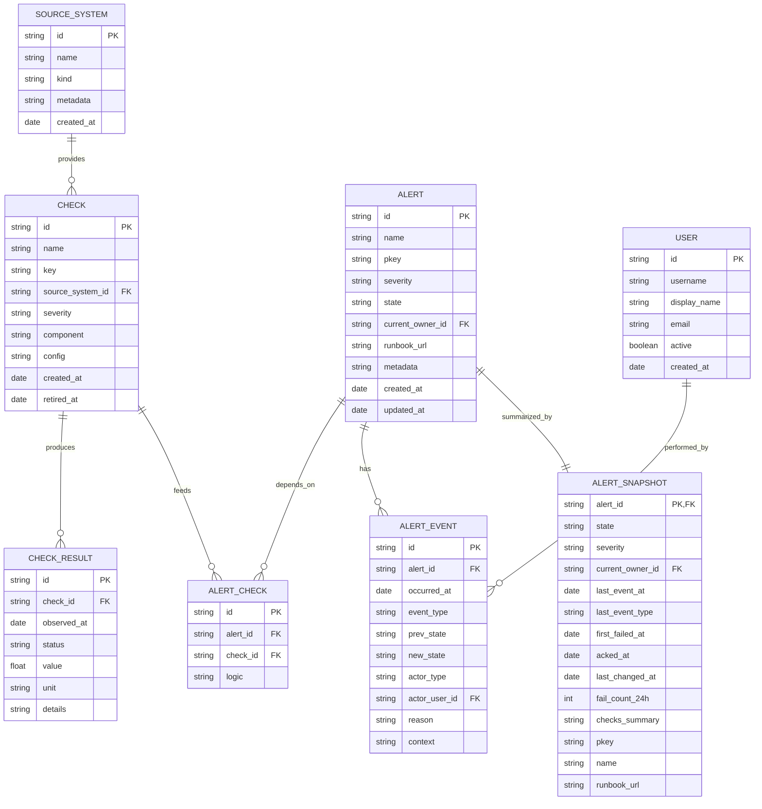

```mermaid
erDiagram
    SOURCE_SYSTEM ||--o{ CHECK : provides
    CHECK ||--o{ CHECK_RESULT : produces
    ALERT ||--o{ ALERT_CHECK : depends_on
    CHECK ||--o{ ALERT_CHECK : feeds
    ALERT ||--o{ ALERT_EVENT : has
    USER ||--o{ ALERT_EVENT : performed_by
    ALERT ||--|| ALERT_SNAPSHOT : summarized_by

    SOURCE_SYSTEM {
      string id PK
      string name
      string kind
      string metadata
      date created_at
    }

    CHECK {
      string id PK
      string name
      string key
      string source_system_id FK
      string severity
      string component
      string config
      date created_at
      date retired_at
    }

    CHECK_RESULT {
      string id PK
      string check_id FK
      date observed_at
      string status
      float value
      string unit
      string details
    }

    ALERT {
      string id PK
      string name
      string pkey
      string severity
      string state
      string current_owner_id FK
      string runbook_url
      string metadata
      date created_at
      date updated_at
    }

    ALERT_CHECK {
      string id PK
      string alert_id FK
      string check_id FK
      string logic
    }

    ALERT_EVENT {
      string id PK
      string alert_id FK
      date occurred_at
      string event_type
      string prev_state
      string new_state
      string actor_type
      string actor_user_id FK
      string reason
      string context
    }

    USER {
      string id PK
      string username
      string display_name
      string email
      boolean active
      date created_at
    }

    ALERT_SNAPSHOT {
      string alert_id PK, FK
      string state
      string severity
      string current_owner_id FK
      date last_event_at
      string last_event_type
      date first_failed_at
      date acked_at
      date last_changed_at
      int fail_count_24h
      string checks_summary
      string pkey
      string name
      string runbook_url
    }
```
