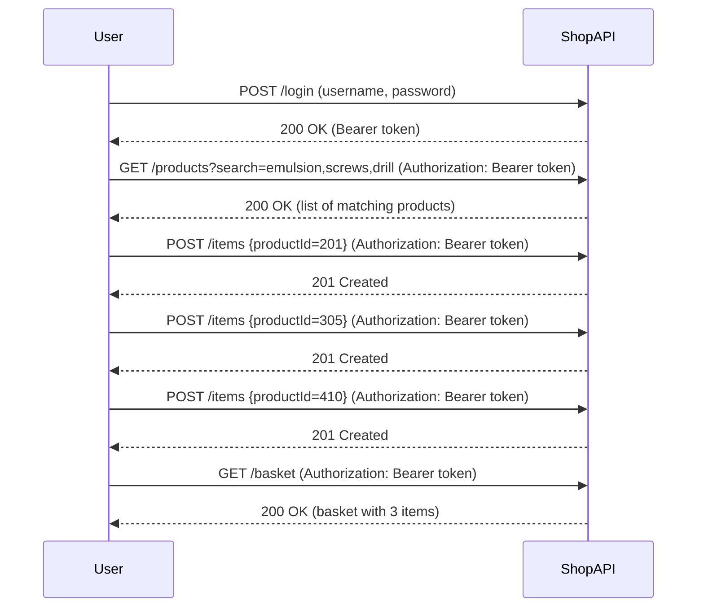

```mermaid
    sequenceDiagram
    participant User
    participant ShopAPI

    User->>ShopAPI: POST /login (username, password)
    ShopAPI-->>User: 200 OK (Bearer token)

    User->>ShopAPI: GET /products?search=emulsion,screws,drill (Authorization: Bearer token)
    ShopAPI-->>User: 200 OK (list of matching products)

    User->>ShopAPI: POST /items {productId=201} (Authorization: Bearer token)
    ShopAPI-->>User: 201 Created

    User->>ShopAPI: POST /items {productId=305} (Authorization: Bearer token)
    ShopAPI-->>User: 201 Created

    User->>ShopAPI: POST /items {productId=410} (Authorization: Bearer token)
    ShopAPI-->>User: 201 Created

    User->>ShopAPI: GET /basket (Authorization: Bearer token)
    ShopAPI-->>User: 200 OK (basket with 3 items)
```
