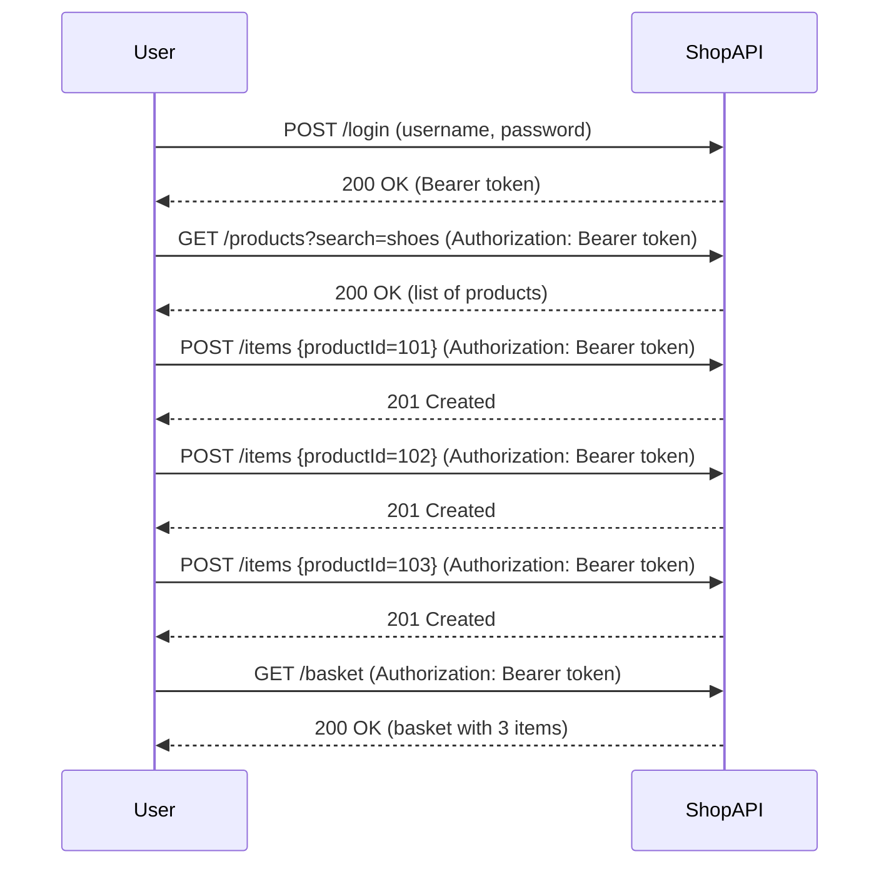

```mermaid
    sequenceDiagram
    participant User
    participant ShopAPI

    User->>ShopAPI: POST /login (username, password)
    ShopAPI-->>User: 200 OK (Bearer token)

    User->>ShopAPI: GET /products?search=shoes (Authorization: Bearer token)
    ShopAPI-->>User: 200 OK (list of products)

    User->>ShopAPI: POST /items {productId=101} (Authorization: Bearer token)
    ShopAPI-->>User: 201 Created

    User->>ShopAPI: POST /items {productId=102} (Authorization: Bearer token)
    ShopAPI-->>User: 201 Created

    User->>ShopAPI: POST /items {productId=103} (Authorization: Bearer token)
    ShopAPI-->>User: 201 Created

    User->>ShopAPI: GET /basket (Authorization: Bearer token)
    ShopAPI-->>User: 200 OK (basket with 3 items)
```
