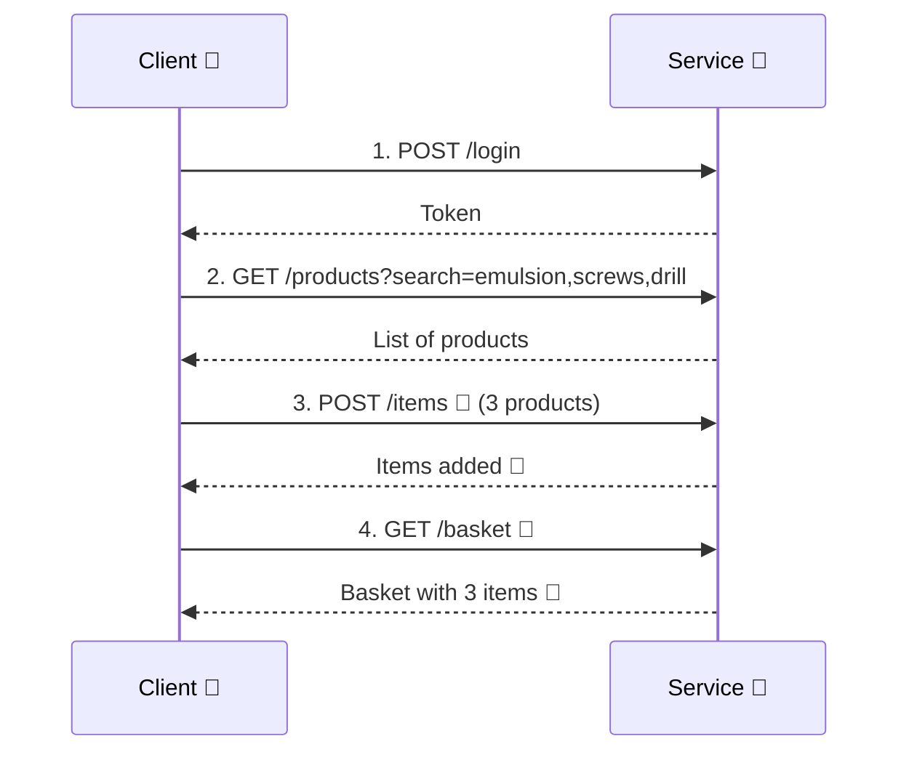

```mermaid
sequenceDiagram
    participant Client 👤
    participant Service 🏬

    Client 👤->>Service 🏬: 1. POST /login
    Service 🏬-->>Client 👤: Token

    Client 👤->>Service 🏬: 2. GET /products?search=emulsion,screws,drill
    Service 🏬-->>Client 👤: List of products

    Client 👤->>Service 🏬: 3. POST /items 🛒 (3 products)
    Service 🏬-->>Client 👤: Items added 🛒

    Client 👤->>Service 🏬: 4. GET /basket 🛒
    Service 🏬-->>Client 👤: Basket with 3 items 🛒
```
