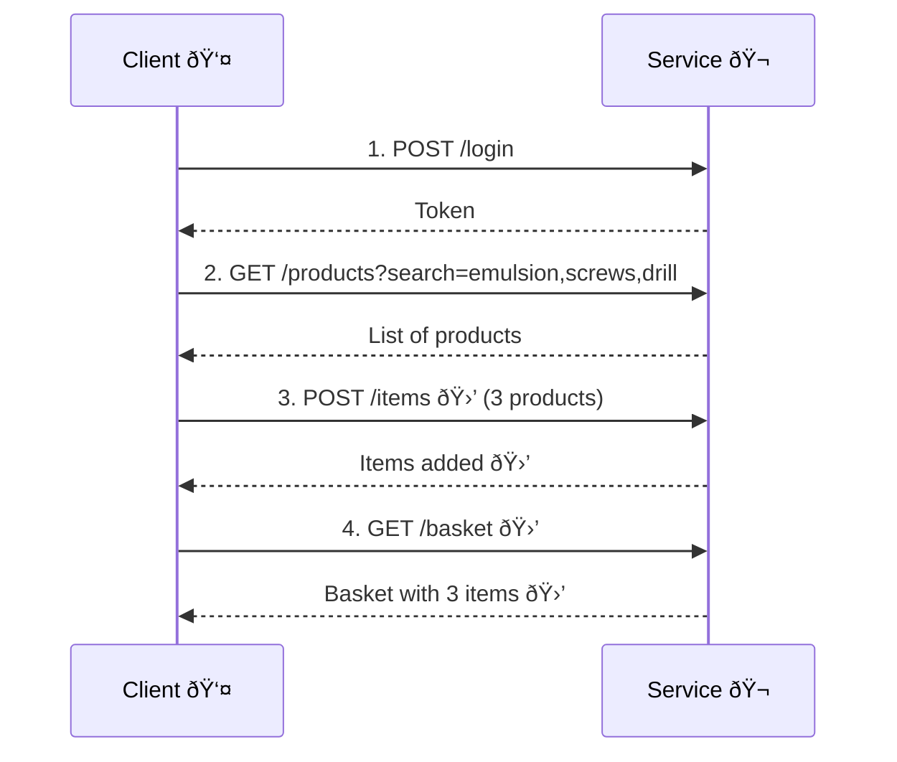
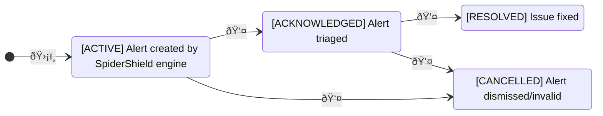

```mermaid
sequenceDiagram
    participant Client 👤
    participant Service ðŸ¬

    Client 👤->>Service ðŸ¬: 1. POST /login
    Service ðŸ¬-->>Client 👤: Token

    Client 👤->>Service ðŸ¬: 2. GET /products?search=emulsion,screws,drill
    Service ðŸ¬-->>Client 👤: List of products

    Client 👤->>Service ðŸ¬: 3. POST /items 🛒 (3 products)
    Service ðŸ¬-->>Client 👤: Items added 🛒

    Client 👤->>Service ðŸ¬: 4. GET /basket 🛒
    Service ðŸ¬-->>Client 👤: Basket with 3 items 🛒
```

```mermaid
stateDiagram-v2
direction LR
    [*] --> ACTIVE: 🛡ï¸
    ACTIVE --> ACKNOWLEDGED : 👤
    ACKNOWLEDGED --> RESOLVED : 👤
    
    ACTIVE --> CANCELLED : 👤
    ACKNOWLEDGED --> CANCELLED : 👤

    ACTIVE : [ACTIVE] Alert created by SpiderShield engine
    ACKNOWLEDGED : [ACKNOWLEDGED] Alert triaged
    RESOLVED : [RESOLVED] Issue fixed
    CANCELLED : [CANCELLED] Alert dismissed/invalid
```
